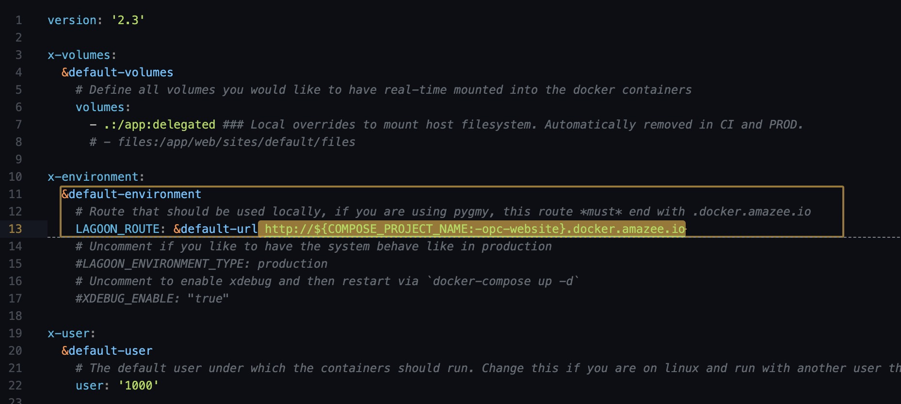
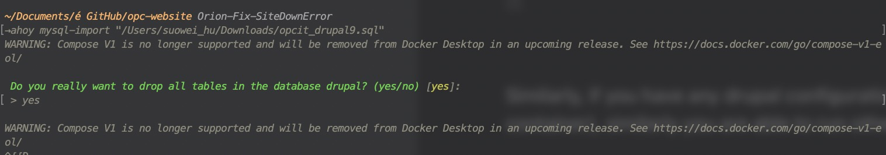

In order to run a instance of the OPC.IT website on your local environment (aka running it on some port of your local machine, for instance 0.0.0.0:80 or 127.0.0.1:80) You will first need to get the source code of the website onto your local machine via VCS (Version Control Software, here we use Gitlab), then use the `pygmy` to start all the required (dependent) Docker containers and add the ssh key, use the `ahoy` to run a customized workflow to build/initiate/run the main Docker containers, and lastly also use `ahoy` to import the database of the production to your local environment.


:::info Pygmy/Ahoy

For more information on how to use these two development tools, refer to their offical documentaion:
- [AHOY! - Automate and organize your workflows, no matter what technology you use.](https://ahoy-cli.readthedocs.io/en/latest/)
- [Pygmy - single tool needed to get the local amazee.io Docker Drupal Development Environment](https://pygmy.readthedocs.io/en/master/)

:::


:::info Ahoy Workflows

The workflow of `ahoy` are defined in the file `.ahoy.yml` located on the root directory of the working repository.

:::


A more detailed work flow will be introduced up next.


### 1 - Version Control (Gitlab)

To begin with, if you wish to make any changes to the `main` branch, you should always make a new branch from the `main`, and start developing based on the new branch; Here we'll assume there's a broken issue on the Orion Monitoring, and we would like to fix it with some code.... Hence we create the new branch `Orion-Fix-FailedToFetchHttpErr` from `main` and clone it to our local machine.

![2023.06.13 - 15_51_34 -  [Google Chrome-OPC eBusiness  OPC Website · GitLab] -](assets/daskldjklasda.jpg)


### 2 - Docker Environment Setup (Pygmy / Ahoy)

After getting the source code onto your local device, you will need to crank up a amazed.io Docker development environment to host your drupal site inside, the setup will involve using  `pygmy` to start all the required (dependent) Docker containers and add the ssh key, use the `ahoy` to run a customized workflow to build/initiate/run the main Docker containers.


![2023.06.13 - 15_46_51 -  [Terminal-~Desktop] -](assets/2023.06.13%20-%2015_46_51%20-%20%20%5BTerminal-~Desktop%5D%20-.jpg)


:::info Ahoy up


Executing the command `ahoy up` is equivalant of running a series of comamnds as follows:

```
docker-compose up -d &&
docker-compose exec cli composer install &&
ahoy info;
```

A full list of  `ahoy`  workflow are defined in the file `.ahoy.yml` located on the root directory of the working repository.


:::


:::info Site URL

The URL is defined in the `docker-compose.yml` file as the follows:



:::


:::warning Site not ready !


Noting that at this point although your website has been ready at [http://opc-website.docker.amazee.io/]( http://opc-website.docker.amazee.io/), you have not yet imported your database, your drupal configuration, hence some of the content of your site will not function as expected, or not displaying at all.


:::


### 3 - Importing Database & Configruation


Lastly, you will need to import the database of the website, (of which you can get the `.sql/.mysql` file via exporting from the production environemnt's CPanel phpMyAdmin), via the `ahoy` workflow of `ahoy mysql-import "{$path_to_file}"` (which will be equivalant to running the database import command inside the Docker container `docker-compose exec cli bash -c 'drush sql-drop' && docker-compose exec -T cli bash -c 'drush sql-cli' < "{$path_to_file}"`). This will import everything that is drupal content related within the production environemnt to your local machine, alike the following shown.





:::warning Confirm before proceed !


This action will override your existing database, so be careful if you have any unsaved content /configuration on your local machine, keep a backup before proceeding via `ahoy mysql-dump {$path_to_file}` if necessary !


:::


Similarly, if you have any drupal configuration, you can import it via `ahoy drush cim` (runs `drush cim` command in the site's container)


![2023.06.13 - 16_16_26 -  [Terminal-~Documentsé GitHubopc-website] -](assets/skdjalkjdlkasdas.jpg)

:::info Drush command via ahoy


Similarly you are able to run other `drush` command with the proxy of `ahoy drush`.

For example `ahoy drush cr`.


:::