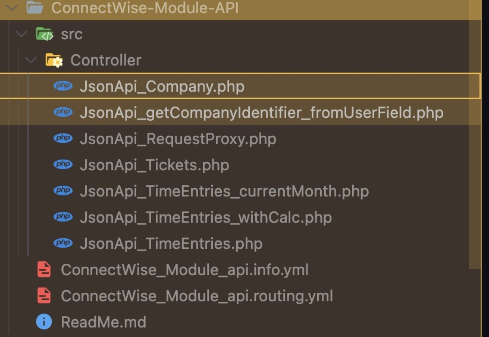

---

sidebar_position: 1
title: "/company"
description: ""
slug: "/orion-monitor/dashboard/devs/api/company"
---

# /Company

- `JsonApi_getCompanyIdentifier_fromUserField.php`: api of getting the company id of current user (field machine name `company_identifier`, see screenshot: [https://share.cleanshot.com/h61DBNlgS9bGZ8t8sJ2L](https://share.cleanshot.com/h61DBNlgS9bGZ8t8sJ2L))
- `JsonApi_Company.php`: api for getting the company details such as address, phone number, main contact, etc; with given company ID (by utilising the proxy to connectwise offical api).

