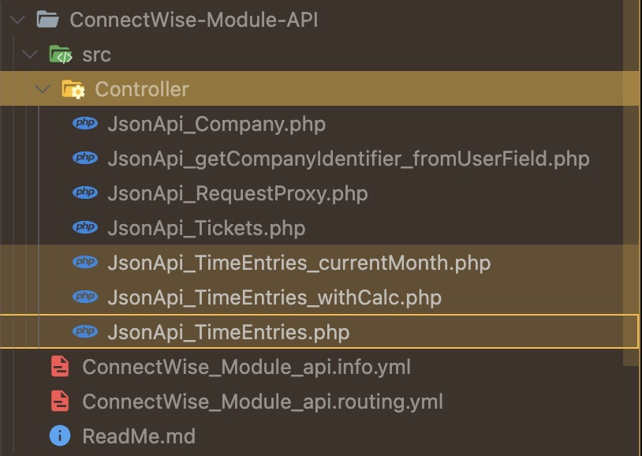

# /time_entries

- `JsonApi_TimeEntries_currentMonth.php`: given the company id, find the sum of time spenditure for this company at the current month (method 1)
- `JsonApi_TimeEntries_withCalc.php`: given the company id, find the sum of time spenditure for this company at the current month (method 2)
- `JsonApi_TimeEntries.php`: given company id, return a list of time spenditure of this company
