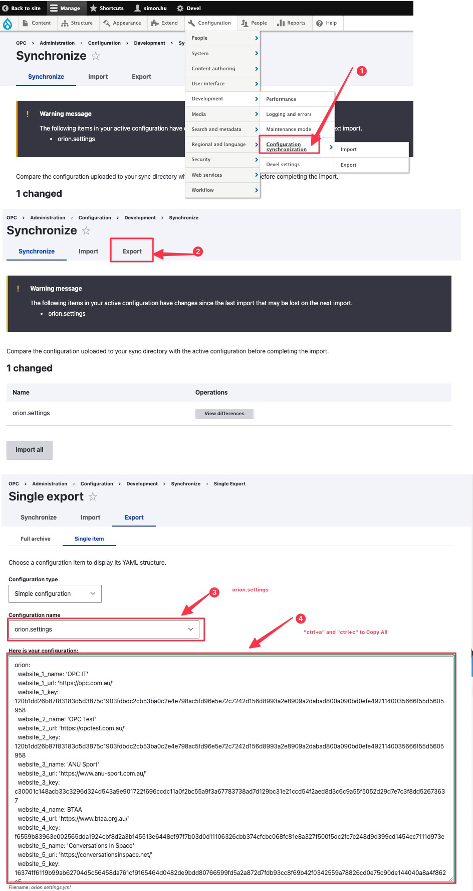

# Installation (drupal 8/9/10^)

### Pre-check for composer 

Before you proceeding to the following tutorial, you will have to make sure your website's drupal module is manged via composer. To do that you will need to login to you "CPanel" then proceed to "File Manager" and check if the file "`composer.json`" and "`composer.lock`" exists in the `public_html` folder. 

![2023.06.08 - 15_06_26 -  [Google Chrome-cPanel - Tools] -](assets/2023.06.08%20-%2015_06_26%20-%20%20%5BGoogle%20Chrome-cPanel%20-%20Tools%5D%20-.jpg)

:::info

If the website is not managed by "composer" then you may use the manual installation process, similar to that of the "installation for druapl 7.0" (i.e. downloading the module manually and put that in "`public_html/module/custom/...`")

:::


---


### Installing Dependency Module

In order to add the website to the Orion Monitor, you will first need to install the two dependent modules: “Vitals” and "Health Check" that will provide the necessary endpoint for Orion module. The following steps will guide you through installing them using composer.

First find the relevant command for the most recent compatible version modules: 

-   [Drupal Custom Module - Vital](https://www.drupal.org/project/vitals) 
-   [Drupal Custom Module - Health Check](https://www.drupal.org/project/health_check)

![2023.06.08 - 15_12_44 -  [Google Chrome-Health check  Drupal.org] -](assets/2023.06.08%20-%2015_12_44%20-%20%20%5BGoogle%20Chrome-Health%20check%20%20Drupal.org%5D%20-.jpg)

Secondly, you will need to open the terminal in your target website and install the modules with your previously copied commands (here we will use `composer require 'drupal/health_check:^3.0'` and `composer require 'drupal/vitals:^2.3'` as an example), this will download the relevant files for these modules, and put them into the proper directory `/public_html/module/custom`. 


![2023.06.08 - 15_16_28 -  [Google Chrome-cPanel - Tools] -](assets/2023.06.08%20-%2015_16_28%20-%20%20%5BGoogle%20Chrome-cPanel%20-%20Tools%5D%20-.jpg)


:::warning

Noting that this will not update the database, the drupal site will not have these two modules enabeld, you will guided to do it slightly later.

:::


Thirdly, to enable the module in the drupal backend, you will need to proceed to the website's extend tab, like the following shown: 

![2023.06.08 - 15_19_24 -  [Google Chrome-Extend  OPC] -](assets/2023.06.08%20-%2015_19_24%20-%20%20%5BGoogle%20Chrome-Extend%20%20OPC%5D%20-.jpg)

Lastly, in CPanel again, you will need to ensure that your `/public_html/.htaccess` contains the two lines (anywhere in the file), then make a full cache clearing via the backend. 

```
...
CacheDisable public / 
CacheDisable private /
...
```

![2023.06.08 - 15_20_58 -  [Google Chrome-cPanel - Tools] -](assets/2023.06.08%20-%2015_20_58%20-%20%20%5BGoogle%20Chrome-cPanel%20-%20Tools%5D%20-.jpg)

![2023.06.08 - 15_24_43 -  [Google Chrome-Extend  OPC] -](assets/2023.06.08%20-%2015_24_43%20-%20%20%5BGoogle%20Chrome-Extend%20%20OPC%5D%20-.jpg)


---


### Configuring the Extension / Orion Setting 

The previous steps will install the required module for the targeted website, in this section we will go through retriving the authentication token from the website, and configure the Orion Monitor. After configuration Orion Monitor will be able to access the website health status, php version, and out-dated modules via that token. 

First, you will copy the authentication token from the "vital configuration" panel, for instance the site you want to monitor is "www.example.com" then you login the drupal backend via "www.example.com/user" and then visit "www.example.com/admin/config/services/vitals".

![2023.06.08 - 15_30_19 -  [Google Chrome-Extend  OPC] -](assets/2023.06.08%20-%2015_30_19%20-%20%20%5BGoogle%20Chrome-Extend%20%20OPC%5D%20-.jpg)

Second, you will need to configure the Orion Monitor, entering the website's name, Url, and the token we just copied, noting that the Url and token is crucial configuration, they has to be exact match with the target website.

![2023.06.08 - 15_39_54 -  [CleanShot-CleanShot] -](assets/2023.06.08%20-%2015_39_54%20-%20%20%5BCleanShot-CleanShot%5D%20-.png)

Lastly check to see your site monitoring on active by visiting "[https://opc.com.au/orion/security](https://opc.com.au/orion/security)", you should be able to see an addition entry of your site active, and the timestamp refreshing, if the timestamp is not refresh, there is a issue connecting to the target site.

![2023.06.08 - 15_45_28 -  [Google Chrome-Installation (drupal 8910^)  Orion] -](assets/2023.06.08%20-%2015_45_28%20-%20%20%5BGoogle%20Chrome-Installation%20(drupal%208910%5E)%20%20Orion%5D%20-.jpg)


---


### Exporting Configuration "orion.settings.yml"

The previous step of "changing orion setting" will make a modifification to the "configuration" of drupal site where the Orion Monitor is sitting on (aka the "[opc.com.au](opc.com.au)" site), consequently, there will be a mismatch between the producation filebase and the development firebase. More specifically, the file `config/sync/orion.settings.yml` will be different on `main`, `stage`, and `production` branch, and if nothing is done, then at the next feature change, the new changes to this file will be overriden by old version. 

:::info

To avoid that we will need to synchronize the changes to that `config/sync/orion.settings.yml` file to all the branches we have. 

:::

First, copy the changes we just made via the drupal backend 



Then paste the changes to your `main` branch, and perform branch merging like you would usually do in development, aka, merging `main` to `stage`, then merging `stage` to `prod`. 

![2023.06.08 - 15_56_52 -  [Google Chrome-OPC eBusiness  OPC Website · GitLab] -](assets/2023.06.08%20-%2015_56_52%20-%20%20%5BGoogle%20Chrome-OPC%20eBusiness%20%20OPC%20Website%20%C2%B7%20GitLab%5D%20-.jpg)

![2023.06.08 - 16_00_03 -  [Google Chrome-branch merging main stage prod - Google Search] -](assets/2023.06.08%20-%2016_00_03%20-%20%20%5BGoogle%20Chrome-branch%20merging%20main%20stage%20prod%20-%20Google%20Search%5D%20-.jpg)


