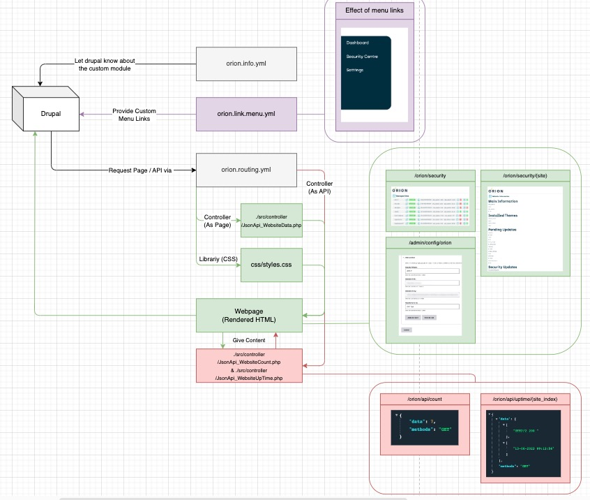
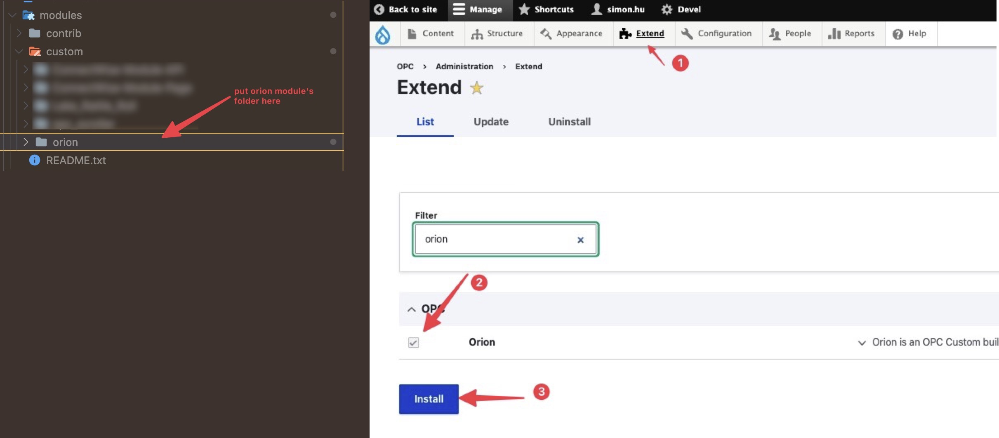

# Installation

The "Orion Security" is in nature a **drupal custom module**, "[logic-flow diagram](assets/image-20230613092159919.png)" (link to the draw.io file: [2023.06.06 ConnectWise-Module-Page.drawio](./src/2023.06.13 orion-security-workflow.drawio)).

:::info

Install the module as normal, see [official drupal installation guide](https://www.drupal.org/documentation/install/) for instructions.

:::

 In order to make the orion dashboard work, you will need to install module: `Orion`. You can installa the module via: first copy pasting the module's working directory into the corresponding folder in drupal (`public_html/site/modules/custom/...`), second enable the modules via the drupal admin: `site > administration > extend`, make sure you run `site_url/update.php` and clear the cache throughly before proceeding.

:::info

Search "web monitoring setup" for instructions of setting up new monitoring for drupal site
(i.e. add a new entry at the [security monitoring panel](assets/image-20230613093422220.png))

:::

