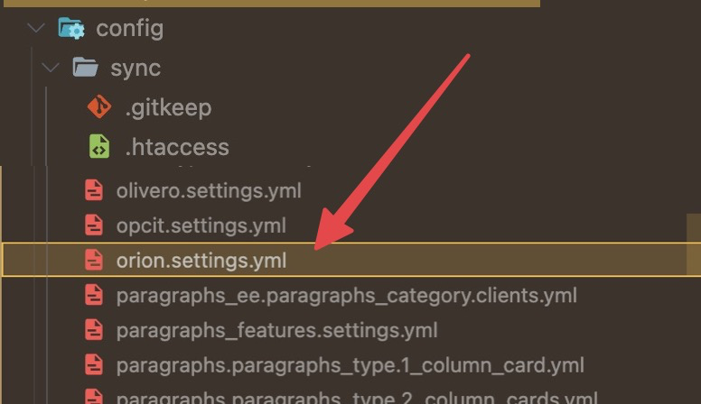
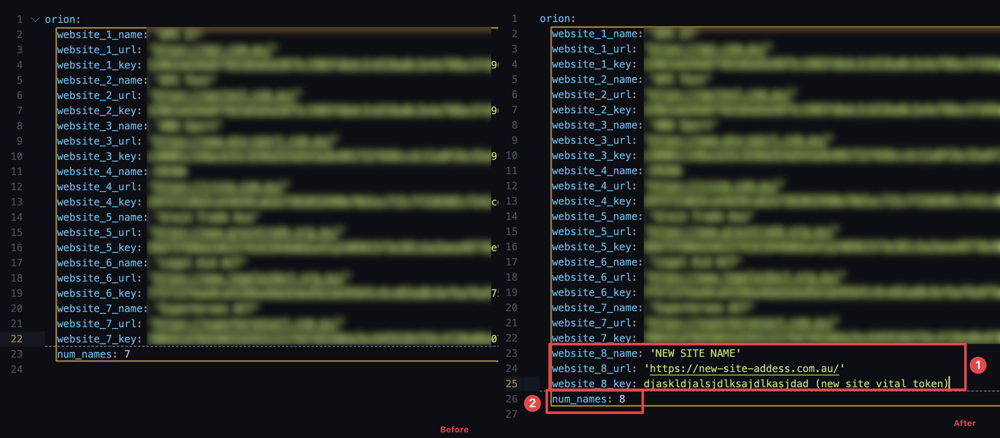

# Website Monitoring Setup (alternative method for developers)

:::warning

This method is for developer that are familiar with drupal's configuration synchronizing, if you are a non development member of the team, you may have a better look at the document [**Website Monitoring Setup (drupal 7^)**](./website-setup-drupal7), and [**Website Monitoring Setup (drupal 8,9,10^)**](./website-setup-drupal8-9-10)

:::

In the previous two instructional documentation, we introduced how to setup a new website monitoring for the Orion, if you are paying a good attention, you must have realized that in previous sections:

-   **Configuring the Extension / Orion Setting:** the setting up of configuration on production site

-   **Exporting Configuration "orion.settings.yml":** the copy-pasting of `/public_htmlconfig/sync/orion.settings` to all Github/Gitlab branch

is in fact duplicating.

### Intuition

Copy-pasting and branch merging (first pushing to `main`, then merging `main` to `stage`, merging `stage` to `prod`) will override the configuration, and **you can directly edit the configuration file**. In another word, if you are a developer that is familiar to how the drupal configuration file works, you may straight edit the "orion.setting.yml" and skip the step of configuraing orion.

### Preperation

:::info
Before you continue, you will need to read the [**previous website monitoring setup**](./website-setup-drupal7) (for the corresponding version of drupal).

This document will only cover "**how to setup the orion configuration via the yaml file**", it will not include "**how to install the dependency module**", nor "**how to get the authentication token from the target site"**.
:::

To begin with, you should get the following entries ready:

-   **Website Name**: any plain text you would like use to represent the website.
-   **Website Address**: the url to the webiste (e.g. `https://opctest.com.au/`).
-   **Website Vital Token**: the token you copy from the [vital's configuration](assets/2023.06.08%20-%2015_30_19%20-%20%20%5BGoogle%20Chrome-Extend%20%20OPC%5D%20-.jpg).

### Setup via editing file 

You will need to following the code scheme listed below, and add your website's monitor configuration into the file `/public_html/config/sync/orion.settings.yml`, you can initiate the change on the `main` branch, then merge the `main` branch to `stage`, `stage` to `prod` for the changes to take effect. 

