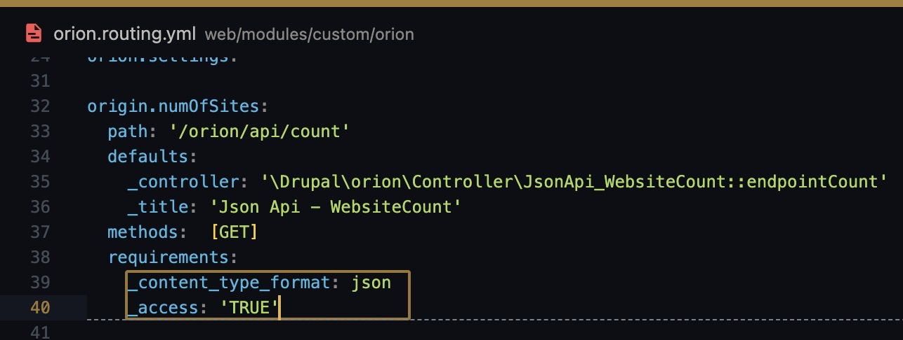
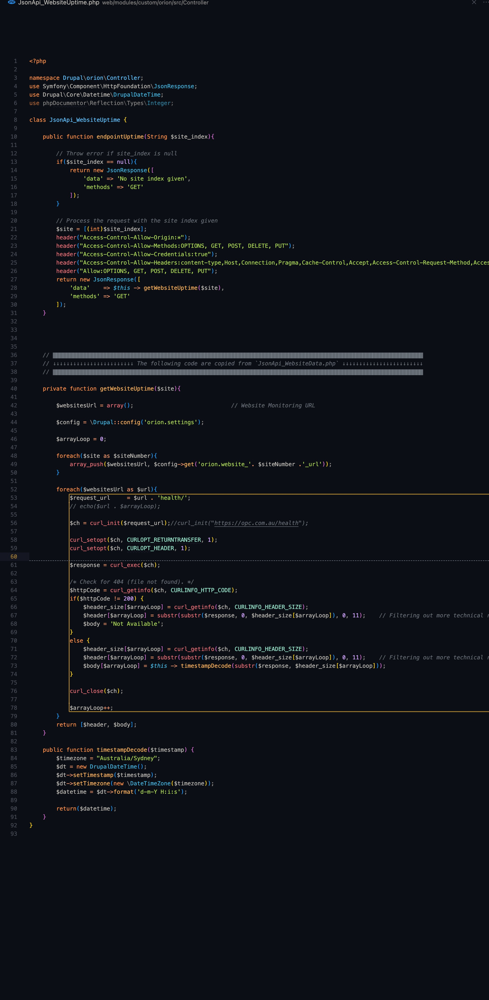

This API will return a integer type of number, which will act as an indication of the number of site in the current monitoring configuration

(say you have 15 site in the monitoring setup, this API will return the following)

![2023.06.13 - 11_13_32 -  [Google Chrome-opc.com.auorionapicount] -](assets/2023.06.13%20-%2011_13_32%20-%20%20%5BGoogle%20Chrome-opc.com.auorionapicount%5D%20-.jpg)

Reference

