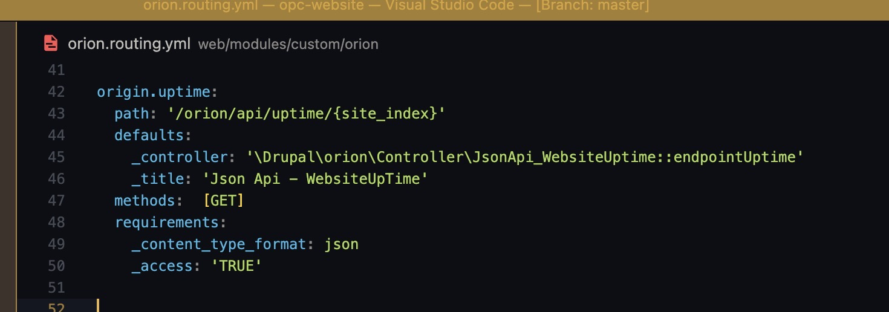
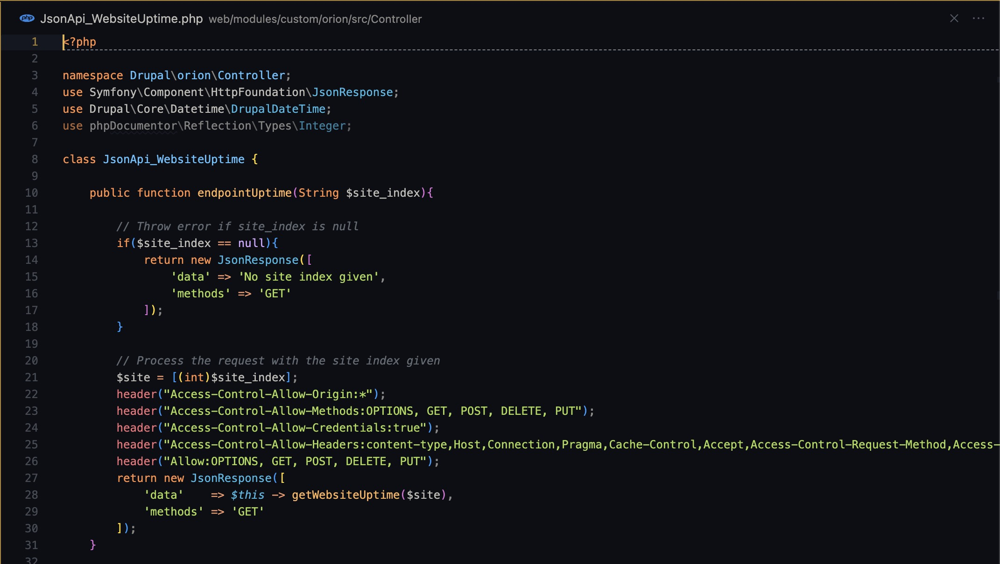

This API is for the purpose of getting the website's status (active or down), through the `/health` end point of the target site. For instance your target site is `www.example.com.au` then it will get the website's status via the URL `www.example.com.au/health`, this is enabled by the previsouly installed `health` module on the target site

![2023.06.13 - 11_19_57 -  [Google Chrome-opc-website.docker.amazee.ioorionapiuptime1] -](assets/2023.06.13%20-%2011_19_57%20-%20%20%5BGoogle%20Chrome-opc-website.docker.amazee.ioorionapiuptime1%5D%20-.jpg)

Reference

